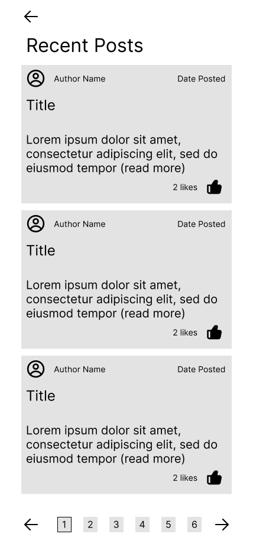

# Cozy Take Home Test

Thanks for you interest in working with us here at Cozy! This 
is a small take home assessment to test your proficiency with 
fetching and rendering data with React Native.

## Setup

To get started with this app you will need a couple things:

- [Node](https://nodejs.org/en)
- [PNPM](https://pnpm.io/)

### Install Dependancies

Once you have those setup you can run `pnpm install` to install 
all the dependancies.

### Start Dev Environment

Once those are setup just run `pnpm dev` 
to start the [json-server](https://github.com/typicode/json-server) API and a development build
of the [Expo](https://docs.expo.dev/) app.

The API will run on port 3000 by default, the Expo app will tell 
you where to access it.

Please use the json-server and Expo/React/React-Native documentation 
while you work on this! I strongly suggest trying to find a solution, as 
I don't expect you to know everything.

## Structure

There are 3 main directories for you to work in:

- `./app`
  - This is where your pages will live. We are using the newer [Expo router](https://expo.github.io/router/docs/) which support FS based routing
- `./components`
  - This is where you will put your reusable components.
- `./hooks`
  - This is where you will put any reusable hooks

## Assessment

Once everything is running here is what is expected of you:

- Build a component that lists all the posts from API.
  - This component should handle pagination
- Each post component should have the following
  - Title
    - Truncate this to 30 characters.
  - Content
    - Truncate this to 100 characters.
  - Number of likes
  - Like button
    - Should like the post if not already liked
    - Should unlike the post if already liked
  - Authors name
  - Authors avatar
  - Date Posted

Here is a basic wireframe to get you started:

Feel free to use any 3rd party packages, but please add the package name 
and the reason it was added to [PACKAGES.md](./PACKAGES.md).

## Questions

If you have any questions or issues, please reach out to me at [graham@gvasquez.dev](mailto:graham@gvasquez.dev).
